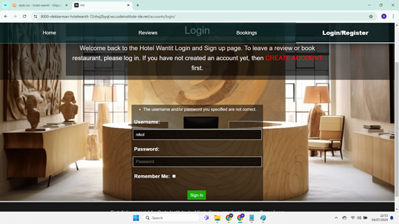

# Manual Testing

## Table of Contents
- [Test Case 1: Login and Logout](#test-case-1-login-and-logout)
- [Test Case 2: Navigation Links](#test-case-2-navigation-links)
- [Test Case 3: Edit and Create Review/Comment](#test-case-3-edit-and-create-reviewcomment)
- [Test Case 4: Reservation Form](#test-case-4-reservation-form)
- [Test Case 5: Availability Check for Rooms](#test-case-5-availability-check-for-rooms)

## Test Case 1: Login and Logout

**Description:**
Test the login and logout functionality.

**Steps:**
1. Navigate to the login page.
2. Enter valid credentials.
3. Click on the login button.
4. Verify successful login.
5. Navigate to various pages and verify the user is logged in.
6. Click on the logout button.
7. Verify successful logout.

**Expected Results:**

### Positive Outcome (Successful Login)
- User successfully logs in with valid credentials.
- Able to access protected pages for authenticated users.
  

#### Additional Scenarios and Images:

### Redirect After Login
- After successful login, verify redirection to the intended page.
  

### Negative Outcome (Invalid Credentials)
- User enters invalid credentials.
- Login form displays error message indicating invalid credentials.
  

### Negative Outcome (Login with Empty Fields)
- Attempt to login with empty username and password fields.
- Form displays validation errors for required fields.
  

### Positive Outcome (Successful Logout)
- User successfully logs out.
- Redirected to the homepage or login page.
  

#### Additional Scenarios:

### Logout Redirect
- After logout, verify redirection to the homepage or login page.

- [x] **CONFIRMED**

[Back to Top](#table-of-contents)

---

## Test Case 2: Navigation Links

**Description:**
Test the functionality of navigation links in the header.

**Steps:**
1. Click on each navigation link (Home, Reviews, Bookings, Admin, Notifications, Login/Register, Logout).
2. Verify that the corresponding page loads correctly for each link.

**Expected Results:**

### Positive Outcome (Navigation Link Click)
- Clicking on each link navigates to the respective page.
- Active state (highlighted link) is correctly applied to the current page's link.
  

#### Scenarios and Images:

### Home Link Navigation
- Click on the Home link and verify navigation to the homepage.
  

### Reviews Link Navigation
- Click on the Reviews link and verify navigation to the reviews page.
  

### Bookings Link Navigation
- Click on the Bookings link and verify navigation to the bookings page.
  

### Admin Link Navigation (Staff User)
- Log in with staff credentials and click on the Admin link.
- Verify navigation to the admin interface page.
  

### Notifications Link Navigation (Authenticated User)
- Log in and click on the Notifications link.
- Verify navigation to the notifications page.
  

### Logout Link Navigation (Authenticated User)
- Log in and click on the Logout link.
- Verify successful logout and redirection to the homepage or login page.
  

### Login/Register Link Navigation (Guest User)
- Click on the Login/Register link.
- Verify navigation to the login/register page.
  

### Negative Outcome (Navigation Link Not Found)
- Attempt to navigate to a non-existent page by modifying the URL directly.
- Verify a 404 error page or appropriate error handling.

[Back to Top](#table-of-contents)

---

## Test Case 3: Edit and Create Review/Comment

**Description:**
Test the functionality of creating and editing reviews and comments.

### Part A: Create Review/Comment

**Steps:**
1. Navigate to a section where users can create a new review or comment.
2. Click on the "Add Review" or "Add Comment" button.
3. Fill in the required fields (e.g., content, rating, title).
4. Submit the form to create the review or comment.
5. Verify that the new review or comment is displayed correctly.

**Expected Results:**

#### Positive Outcome (Successful Creation)
- Form allows submission of new review or comment with required fields.
- Submitted content is displayed correctly in the designated section.

#### Additional Scenarios and Images:

### Create with Empty Fields
- Submit the creation form without filling in all required fields (e.g., leaving content field empty).
- Verify that the form displays appropriate validation errors for missing fields.

### Create with Long Content
- Create a review or comment with a large amount of text exceeding typical limits.
- Verify that the application handles and displays long content properly without truncating or causing display issues.

### Part B: Edit Review/Comment

**Steps:**
1. Navigate to a review or comment section.
2. Find an existing review or comment.
3. Click on the edit button/icon.
4. Modify the content, rating, or title of the review or comment.
5. Submit the edited content.
6. Verify that the updated review or comment is displayed correctly.

**Expected Results:**

#### Positive Outcome (Successful Edit)
- Edit form allows modification of existing review or comment content.
- Submitted changes are reflected correctly in the review or comment section.

#### Additional Scenarios and Images:

### Edit Empty Content
- Attempt to edit a review or comment by removing all existing content.
- Verify that the form prevents submitting empty content and displays an error.

### Edit with Special Characters
- Edit a review or comment and include special characters (e.g., emojis, symbols).
- Verify that the form accepts special characters and displays them correctly after submission.

### Edit Long Content
- Edit a review or comment to include a long text exceeding typical character limits.
- Verify that the form handles and displays long content properly without truncating or causing display issues.

### Negative Outcome (Unauthorized Edit)
- Attempt to edit a review or comment belonging to another user (if applicable to your application).
- Verify that the application prevents unauthorized edits and displays an error or access denied message.

[Back to Top](#table-of-contents)

---

## Test Case 4: Reservation Form

**Description:**
Test the functionality of the reservation form for booking rooms.

**Steps:**
1. Navigate to the Bookings page.
2. Click on the Reserve Room button or link.
3. Fill in the reservation form with different scenarios, including missing required fields.
4. Submit the form and verify the booking process.

**Expected Results:**

### Part A: Reservation Form Submission

#### Positive Outcome (Successful Form Submission)
- Form is filled with valid data.
- Submitting the form successfully reserves the room.

#### Additional Scenarios and Images:

### Empty Fields

#### Negative Outcome (Missing Required Fields)
- Leave one or more required fields (name, email, phone, check-in date, checkout date) empty.
- Form submission triggers validation errors for missing fields.

### Invalid Date Range

#### Negative Outcome (Invalid Date Range)
- Enter a checkout date that is before the check-in date.
- Form submission triggers a validation error indicating an invalid date range.

### Invalid Email Format

#### Negative Outcome (Invalid Email Format)
- Enter an invalid email format (e.g., missing '@' symbol).
- Form submission triggers a validation error for invalid email format.

### Additional Scenarios:

#### Form Autofill

- Test form autofill functionality using browser settings.

- [x] **CONFIRMED**

#### Form Reset

- Test the form reset button to clear all entered data.

- [x] **CONFIRMED**

[Back to Top](#table-of-contents)

---

## Test Case 5: Availability Check for Rooms

**Description:**
Test the availability check functionality for booking rooms.

**Steps:**
1. Navigate to the Bookings page.
2. Enter check-in and check-out dates.
3. Click on the availability check or submit button.
4. Verify if rooms are available for the selected dates.

**Expected Results:**

### Part A: Availability Check

#### Positive Outcome (Rooms Available)
- Available rooms are displayed based on the selected dates.
- No availability messages or errors are shown.

#### Additional Scenarios and Images:

### No Rooms Available

#### Negative Outcome (No Rooms Available)
- No rooms are available for the selected dates.
- Availability check displays a message indicating no rooms are available.

### Overlapping Reservations

#### Negative Outcome (Overlapping Reservations)
- Attempt to book a room for dates that overlap with an existing reservation.
- Verify that the availability check prevents overlapping reservations and displays an error message.

### Check with Past Dates

### Additional Scenarios:

#### Availability Check Performance

- Test the availability check performance with a large dataset of rooms and bookings.

- [x] **CONFIRMED**

#### Availability Check Reset

- Test the availability check reset button to clear entered dates and reset the form.

- [x] **CONFIRMED**

[Back to Top](#table-of-contents)

---
