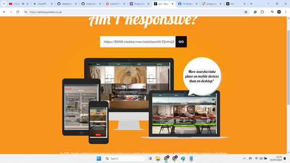
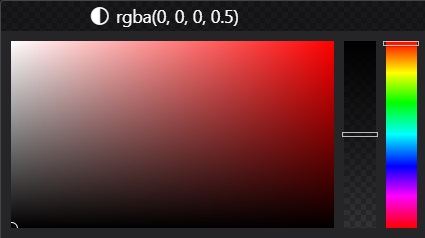
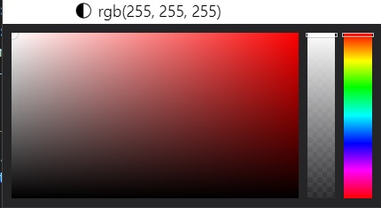
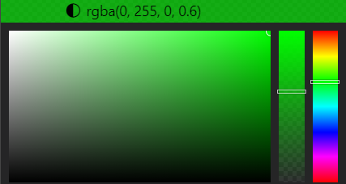
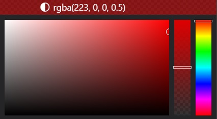

# Hotel Wantit

## Introduction

Welcome to the Hotel Wantit page! This page is designed to offer a user-friendly and interactive experience for guests looking to book hotel rooms and restaurant tables at Hotel Wantit. Additionally, users can easily obtain all the information they need through our interactive chat feature.

## Table of Contents

- [Hotel Wantit](#hotel-wantit)
  - [Introduction](#introduction)
  - [Table of Contents](#table-of-contents)
  - [User Experience](#user-experience)
    - [User Goals](#user-goals)
      - [Hotel Guest/User](#hotel-guestuser)
      - [Admin](#admin)
      - [Owner](#owner)
  - [User Stories](#user-stories)
    - [Admin Dashboard Management](#admin-dashboard-management)
    - [Notifications and Interaction Management](#notifications-and-interaction-management)
    - [Manage Reviews](#manage-reviews)
    - [Booking System](#booking-system)
  - [Design](#design)
    - [Style Description](#style-description)
    - [Color Palette](#color-palette)
  - [Testing](#testing)
    - [Manual Testing](#manual-testing)
    - [Validation](#validation)
  - [Technologies Used](#technologies-used)
  - [Deployment](#deployment)
    - [Create a GitHub Repository](#create-a-github-repository)
    - [Push Code to GitHub](#push-code-to-github)
    - [Development](#development)
      - [GitHub Repository](#github-repository)
      - [Installation](#installation)
      - [Deployment on Heroku](#deployment-on-heroku)
    - [Accessing Application](#accessing-application)
  - [Credits](#credits)
    - [Images](#images)
    - [Acknowledgements](#acknowledgements)

# User Experience

## User Goals

### Hotel Guest/User

1. **Efficient Reservation Management**
   - *Goal:* Easily browse available rooms, select preferred dates, and make reservations seamlessly.
   - *Benefits:* Allows guests to efficiently plan and organize their accommodation needs.

2. **Transparent Booking Process**
   - *Goal:* Receive clear and detailed information about room types, amenities, prices, and availability.
   - *Benefits:* Helps guests make informed decisions and ensures expectations are met upon arrival.

3. **Interactive Feedback Mechanism**
   - *Goal:* Provide feedback through reviews and comments to share experiences and help improve service quality.
   - *Benefits:* Enhances user engagement and contributes to continuous improvement of services.

4. **Accessible Reservation Management**
   - *Goal:* Manage reservations, view booking details, and easily cancel bookings if necessary.
   - *Benefits:* Offers flexibility and control over bookings, ensuring a smooth experience.

5. **Responsive User Interface**
   - *Goal:* Access the booking system from various devices (desktop, tablet, mobile) with consistent usability.
   - *Benefits:* Provides convenience and accessibility for users on the go.

---

### Admin

1. **Centralized Management**
   - *Goal:* Monitor and manage reservations, reviews, and comments efficiently from a central dashboard.
   - *Benefits:* Facilitates oversight and ensures timely handling of guest interactions and feedback.

2. **Streamlined Approval Process**
   - *Goal:* Review and approve/reject pending reservations, reviews, and comments.
   - *Benefits:* Maintains quality control and responsiveness to guest needs and feedback.

3. **Enhanced Communication**
   - *Goal:* Communicate effectively with users regarding booking confirmations, updates, and responses to reviews/comments.
   - *Benefits:* Improves customer satisfaction and engagement through timely and personalized communication.

4. **Data-Driven Decision Making**
   - *Goal:* Utilize analytics and reports derived from reservation and feedback data to improve service offerings.
   - *Benefits:* Enables informed decisions to enhance guest experience and operational efficiency.

---

### Owner

1. **Business Growth and Profitability**
   - *Goal:* Increase occupancy rates and revenue through efficient booking and management processes.
   - *Benefits:* Maximizes profitability and supports sustainable business growth.

2. **Brand Reputation Management**
   - *Goal:* Maintain a positive online reputation through responsive customer service and proactive management of reviews.
   - *Benefits:* Builds trust with guests and enhances the hotel's brand image.

3. **Operational Efficiency**
   - *Goal:* Optimize resource allocation and operational processes based on reservation data and guest feedback.
   - *Benefits:* Improves efficiency, reduces costs, and enhances overall service delivery.

4. **Innovative Service Offerings**
   - *Goal:* Introduce new services or amenities based on guest preferences and market trends identified through booking and feedback data.
   - *Benefits:* Differentiates the hotel from competitors and attracts more guests.

## User Stories

### Admin Dashboard Management

**As an Admin, I want to access and manage reservations, comments, and reviews from a centralized dashboard so that I can efficiently oversee activities on the platform.**

**Description:**
The admin dashboard provides a centralized interface for admins to monitor and manage reservations, comments, and reviews. Admins can view counts of pending items and navigate to specific management pages for detailed actions.

**Acceptance Criteria:**
- **AC1:** Display the Admin Dashboard page with a title "Admin Dashboard."
- **AC2:** Include management cards for Reservations, Comments, and Reviews.
  - **AC2.1:** Each card displays the count of pending items.
  - **AC2.2:** Each card includes a brief description of its function.
- **AC3:** Clicking on a card navigates to the respective management page:
  - **AC3.1:** Reservations card navigates to Reservations Approval List.
  - **AC3.2:** Comments card navigates to Comments Approval List.
  - **AC3.3:** Reviews card navigates to Reviews Approval List.
- **AC4:** Ensure the dashboard layout is responsive to different screen sizes.

---

### Notifications and Interaction Management

**As a User, I want to manage my reservations, pending reviews, and pending comments from a notifications page so that I can efficiently organize my interactions within the hotel booking system.**

**Description:**
Users can access a notifications page where they can view and manage their reservations, pending reviews awaiting approval, and pending comments. This page enhances user interaction by providing a central hub for managing activities related to their bookings and interactions.

**Acceptance Criteria:**
- **AC1:** Users can navigate to the notifications page after logging into the hotel site.
- **AC2:** The notifications page prominently displays sections for "Reservations," "Pending Reviews," and "Pending Comments."
- **AC3:** Each section lists items with basic details (e.g., reservation IDs, review excerpts, comment previews).
- **AC4:** Clicking on an item within a section opens a modal or detailed view with comprehensive information.
- **AC5:** The notifications page is responsive and adjusts layout gracefully across different devices.

---

### Manage Reviews

**As a User, I want to create, edit, delete, and view details of my reviews so that I can share experiences and manage feedback effectively within the hotel booking system.**

**Description:**
Users have the ability to perform CRUD operations on their reviews, including creating new reviews, editing existing ones, deleting reviews, and viewing detailed information. This functionality allows users to maintain and update their review content as needed.

**Acceptance Criteria:**
- **AC1:** Users can create new reviews, providing details such as ratings and comments.
- **AC2:** Users can edit their existing reviews to update information or correct errors.
- **AC3:** Users can delete their reviews if they choose to remove them from the system.
- **AC4:** The system displays detailed information for each review, including ratings, comments, and related data.

---

### Booking System

**As a User, I want to easily reserve a room online, manage my bookings, and receive confirmation details so that I can efficiently plan and organize my accommodation needs.**

**Description:**
The booking system enables users to browse available rooms, select dates, make reservations, manage bookings, and receive confirmation details. This functionality ensures a seamless booking experience for users planning their accommodation within the hotel.

**Acceptance Criteria:**
- **AC1:** Users can view details of available rooms, including room types, amenities, and prices.
- **AC2:** Users can select check-in and check-out dates, choose room types, and initiate the reservation process.
- **AC3:** Users receive confirmation of their reservation with details such as room number, dates, total price, and booking status.
- **AC4:** Users can cancel their reservations if needed.
- **AC5:** The system suggests alternative room options if the selected room type is unavailable for the chosen dates.

## Design
## Style Description

Our project embraces a minimalist design ethos with a touch of uniqueness that sets it apart. This approach ensures clarity in navigation and actions, making the user experience intuitive and engaging.

## Design

# Color Palette

## Background Colors

### Primary Background

- **Color Code:** #f0f0f0
- **Description:** The primary background color #f0f0f0 provides a clean and neutral base throughout the interface.
- **Image:** 

## Text Color

- **Color Code:** #333
- **Description:** The text color #333 ensures readability and contrasts effectively against the background.
- **Image:** 

## Button Colors

### Positive Button

- **Color Code:** rgba(0, 255, 0, 0.6)
- **Description:** This color is used for positive action buttons.
- **Image:** 

### Negative Button

- **Color Code:** rgba(223, 0, 0, 0.5)
- **Description:** This color is used for negative action buttons, indicating cancellation or deletion.
- **Image:** 

[Back to Top](#table-of-contents)

---

# Testing

### Manual Testing

- For detailed manual testing procedures, please refer to [MANUAL_TESTING.md](MANUAL_TESTING.md).

[Back to Top](#table-of-contents)

---

### Validation

- Validation processes and criteria are documented in [VALIDATION.md](VALIDATION.md).

[Back to Top](#table-of-contents)

---

## Technologies Used

- **Django**: Python-based web framework used for backend development.
- **Bootstrap**: Frontend framework for responsive design and UI components.
- **jQuery**: JavaScript library used for DOM manipulation and AJAX.
- **Font Awesome**: Icon toolkit used for icons throughout the application.
- **Animate.css**: Library for CSS animations used for visual effects.
- **Bootstrap Datepicker**: Plugin for date selection in forms.
- **HTML/CSS**: Frontend languages for structuring and styling web pages.
- **JavaScript**: Used for client-side scripting and enhancing user interactions.
- **Git & GitHub**: Version control and repository hosting platform.
- **Photoshop**: Used for designing graphical elements and assets.
## Deployment

[Back to Top](#table-of-contents)

---

### Create a GitHub Repository

1. Created a new repo on GitHub from the [Code Institute template](https://github.com/Code-Institute-Org/gitpod-full-template).

### Push Code to GitHub

1. Initialized a Git repository locally.
2. Added and committed HTML, CSS, and other relevant files.
3. Pushed the code to the GitHub repository.

[Back to Top](#table-of-contents)

---

## Development

### GitHub Repository

- The source code for Hotel Wantit is on GitHub. You can find the repository at:
  [Hotel Wantit Repository](https://github.com/nlekkerman/hotel-wantit.git)
  
- Feel free to explore the codebase, open issues, and submit pull requests.

### Installation

#### Cloning Hotel Wantit Repository in Visual Studio

1. Open Visual Studio: On the start window, select "Clone a repository."
2. Enter Repository URL: In the "Clone a Repository" window, enter the repository URL: `https://github.com/nlekkerman/hotel-wantit.git`
3. Choose Local Directory: Choose a directory on your local machine where you want to clone the repository.
4. Click "Clone": Click the "Clone" button.
5. Open Cloned Project: Once the cloning process is complete, open the cloned project in your IDE.

- Now you have the Hotel Wantit project cloned to your local machine, and you can explore, modify, and run it from within Visual Studio.

[Back to Top](#table-of-contents)

---

#### Cloning with Terminal or Command Prompt

1. Open a terminal or command prompt.
2. Navigate to Local Directory: `cd path/to/your/directory`
3. Clone Repository: Run the following command to clone the Hotel Wantit repository from GitHub:
git clone https://github.com/nlekkerman/hotel-wantit.git

4. Navigate to Cloned Project: `cd hotel-wantit`

- Now you have the Hotel Wantit project cloned to your local machine, and you can explore.

## Deployment on Heroku

To deploy my application on Heroku, I followed these steps:

### Create a Heroku Account

1. Created a Heroku account on [Heroku's website](https://www.heroku.com/).

### Login to Heroku

- Logged in to my Heroku account.

### Prepare Application

1. Ensured that my project was set up properly and contained all necessary files.

2. Verified that my project had a `requirements.txt` file containing all Python dependencies required for my application.

### Connect Heroku with GitHub

1. Connected Heroku with my GitHub repository.

2. Set up automatic deployment so that Heroku builds and deploys my application whenever I push changes to GitHub.

[Back to Top](#table-of-contents)

---

### Deployment of Application

- With automatic deployment set up, Heroku automatically built and deployed my application whenever I pushed changes to my GitHub repository.

### Accessing Application

- After a successful deployment, I accessed my application by opening the URL provided by Heroku.

[Link to the deployed application](https://hotel-wantit-0444de03d75c.herokuapp.com/) 

[Back to Top](#table-of-contents)

----

## Credits

### Images
- Image by [vecstock on Freepik](https://www.freepik.com/free-ai-image/bedroom-with-chandelier-bed-with-blanket-it_42293048.htm#fromView=search&page=1&position=3&uuid=8bf78fdd-a1f0-4299-beb6-94a9d872d08a)
- Image by [freepik](https://www.freepik.com/free-ai-image/interior-design-neoclassical-style-with-furnishings-decor_138316835.htm#fromView=search&page=1&position=34&uuid=5a4cb3a7-4be1-45af-8c96-330c99918f93)
- Image by [freepik](https://www.freepik.com/free-ai-image/rendering-elegant-neoclassical-interior_94940198.htm#fromView=search&page=1&position=36&uuid=5a4cb3a7-4be1-45af-8c96-330c99918f93)
- Image by [dit26978 on Freepik](https://www.freepik.com/free-photo/3d-rendering-beautiful-comtemporary-luxury-bedroom-suite-hotel-with-tv_24803801.htm#fromView=search&page=1&position=31&uuid=77aeb5c3-6ef7-4084-ac0e-045121bf4959)
- Image by [mrsiraphol on Freepik](https://www.freepik.com/free-photo/spacious-hotel-room-with-rug_968440.htm#fromView=search&page=2&position=8&uuid=77aeb5c3-6ef7-4084-ac0e-045121bf4959)
- Icon by [juicy_fish on Freepik](https://www.freepik.com/search)
- Image by [upklyak on Freepik](https://www.freepik.com/free-vector/alert-warning-emergency-notification-3d-render_32230554.htm#fromView=search&page=3&position=16&uuid=b94e0487-7a40-4694-b9bf-e5eba093d534)
- Image by [freepik](https://www.freepik.com/free-ai-image/interior-design-neoclassical-style-with-furnishings-decor_138316853.htm#fromView=search&page=1&position=0&uuid=ee901e76-2088-4809-ad65-5e8ed285a4a9)
- Image by [stockgiu on Freepik](https://www.freepik.com/free-ai-image/modern-luxury-bathroom-with-marble-sink-elegant-chandelier-illuminated-faucet-generated-by-ai_48651085.htm#fromView=search&page=1&position=11&uuid=7a957443-60c5-492b-b7d2-f2e6e4b0cd5d)
- Image by [freepik](https://www.freepik.com/free-ai-image/interior-design-neoclassical-style-with-furnishings-decor_138316892.htm#fromView=search&page=1&position=29&uuid=7a957443-60c5-492b-b7d2-f2e6e4b0cd5d)
- Image by [freepik](https://www.freepik.com/free-ai-image/photorealistic-stone-wall-surface-used-interior-design_138363665.htm#fromView=search&page=1&position=37&uuid=7a957443-60c5-492b-b7d2-f2e6e4b0cd5d)
- Image by [vecstock on Freepik](https://www.freepik.com/free-ai-image/large-group-objects-winery-generated-by-ai_43160903.htm#fromView=search&page=1&position=10&uuid=00634b15-4b9a-43a5-9e1c-98a2d0c0d464)
- Image by [vecstock on Freepik](https://www.freepik.com/free-photo/cocktail-celebration-martini-lemon-lime-whiskey-tequila-generative-ai_41060997.htm#from_view=detail_alsolike)
- Image by [vecstock on Freepik](https://www.freepik.com/free-ai-image/refreshing-cocktails-poured-bar-counter-vibrant-nightclub-generated-by-artificial-intelligence_89236283.htm#fromView=search&page=1&position=8&uuid=00634b15-4b9a-43a5-9e1c-98a2d0c0d464)
- Image by [vecstock on Freepik](https://www.freepik.com/free-ai-image/abundance-wine-bottles-retail-store-generated-by-ai_43159641.htm#fromView=search&page=1&position=36&uuid=00634b15-4b9a-43a5-9e1c-98a2d0c0d464)
- Image by [upklyak on Freepik](https://www.freepik.com/free-vector/error-404-page-found-confused-characters_28998047.htm#fromView=search&page=1&position=51&uuid=9638879a-e833-493a-a207-b7884e782551)

### Acknowledgements

- **Brian O'Hare**: Mentor who provided valuable guidance throughout the development process.
- **Walkthrough Blog - I Think Therefore I Blog**: Provided helpful resources and insights for building this project.

[Back to Top](#table-of-contents)