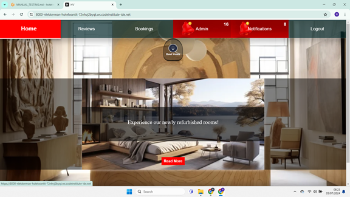
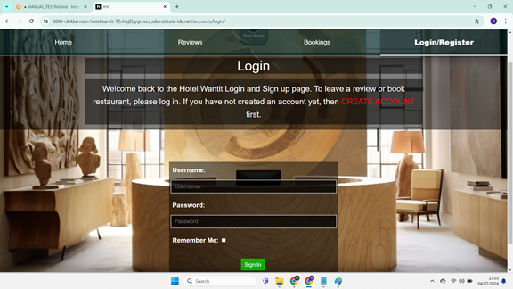

# Hotel Wantit

## Introduction

Welcome to the Hotel Wantit page! This page is designed to offer a user-friendly and interactive experience for guests looking to book hotel rooms and restaurant tables at Hotel Wantit. Additionally, users can easily obtain all the information they need through our interactive chat feature.

## Table of Contents
- [Hotel Wantit](#hotel-wantit)
  - [Introduction](#introduction)
  - [Table of Contents](#table-of-contents)
  - [User Experience](#user-experience)
    - [User Goals](#user-goals)
    - [Admin Goals](#admin-goals)
    - [Owner Goals](#owner-goals)
  - [User Stories](#user-stories)
    - [Admin Dashboard Management](#admin-dashboard-management)
    - [Notifications and Interaction Management](#notifications-and-interaction-management)
    - [Manage Reviews](#manage-reviews)
    - [Booking System](#booking-system)
  - [Design](#design)
    - [Style Description](#style-description)
    - [Color Palette](#color-palette)
  - [Features](#features)
    - [Header](#header)
      - [Navigation Bar](#navigation-bar)
      - [Navigation Bar (as a logged in user)](#navigation-bar-as-a-logged-in-user)
      - [Navigation Bar (as a staff member or superuser)](#navigation-bar-as-a-staff-member-or-superuser)
    - [Home Page Features](#home-page-features)
    - [Reviews Page Features](#reviews-page-features)
    - [Review Detail Page Features](#review-detail-page-features)
    - [Admin Dashboard Features](#admin-dashboard-features)
      - [Reservations](#reservations)
      - [Comments](#comments)
      - [Reviews](#reviews-1)
    - [Notifications](#notifications-1)
    - [Sign Up Form](#sign-up-form)
    - [Sign Out Confirmation Page](#sign-out-confirmation-page)
    - [Login Page](#login-page)
  - [Testing](#testing)
    - [Validation of Code](#validation-of-code)
      - [HTML](#html)
      - [CSS](#css)
      - [JavaScript](#javascript)
      - [Python](#python)
    - [Lighthouse](#lighthouse)
      - [Desktop](#desktop)
      - [Mobile](#mobile)
    - [Wave Webaim - accessibility testing](#wave-webaim---accessibility-testing)
      - [Index page](#index-page)
      - [About page](#about-page)
      - [Booking page](#booking-page)
      - [Contrast Grid](#contrast-grid)
    - [Automated Testing](#automated-testing)
      - [About](#about)
      - [Booking](#booking)
      - [News](#news)
    - [Manual Testing](#manual-testing)
  - [Bugs](#bugs)
  - [Technologies Used](#technologies-used)
  - [Deployment](#deployment)
    - [Fork repository in GitHub](#fork-repository-in-github)
    - [Clone repository in GitHub](#clone-repository-in-github)
    - [Deployment to Heroku](#deployment-to-heroku)
  - [Credits](#credits)
    - [Libraries used](#libraries-used)
    - [Used resources](#used-resources)
    - [Images](#images)
    - [Acknowledgements](#acknowledgements)
## User Experience
## User Goals

### Hotel Guest/User

1. **Efficient Reservation Management**
   - *Goal:* Easily browse available rooms, select preferred dates, and make reservations seamlessly.
   - *Benefits:* Allows guests to efficiently plan and organize their accommodation needs.

2. **Transparent Booking Process**
   - *Goal:* Receive clear and detailed information about room types, amenities, prices, and availability.
   - *Benefits:* Helps guests make informed decisions and ensures expectations are met upon arrival.

3. **Interactive Feedback Mechanism**
   - *Goal:* Provide feedback through reviews and comments to share experiences and help improve service quality.
   - *Benefits:* Enhances user engagement and contributes to continuous improvement of services.

4. **Accessible Reservation Management**
   - *Goal:* Manage reservations, view booking details, and easily cancel bookings if necessary.
   - *Benefits:* Offers flexibility and control over bookings, ensuring a smooth experience.

5. **Responsive User Interface**
   - *Goal:* Access the booking system from various devices (desktop, tablet, mobile) with consistent usability.
   - *Benefits:* Provides convenience and accessibility for users on the go.

---

### Admin

1. **Centralized Management**
   - *Goal:* Monitor and manage reservations, reviews, and comments efficiently from a central dashboard.
   - *Benefits:* Facilitates oversight and ensures timely handling of guest interactions and feedback.

2. **Streamlined Approval Process**
   - *Goal:* Review and approve/reject pending reservations, reviews, and comments.
   - *Benefits:* Maintains quality control and responsiveness to guest needs and feedback.

3. **Enhanced Communication**
   - *Goal:* Communicate effectively with users regarding booking confirmations, updates, and responses to reviews/comments.
   - *Benefits:* Improves customer satisfaction and engagement through timely and personalized communication.

4. **Data-Driven Decision Making**
   - *Goal:* Utilize analytics and reports derived from reservation and feedback data to improve service offerings.
   - *Benefits:* Enables informed decisions to enhance guest experience and operational efficiency.

---

### Owner

1. **Business Growth and Profitability**
   - *Goal:* Increase occupancy rates and revenue through efficient booking and management processes.
   - *Benefits:* Maximizes profitability and supports sustainable business growth.

2. **Brand Reputation Management**
   - *Goal:* Maintain a positive online reputation through responsive customer service and proactive management of reviews.
   - *Benefits:* Builds trust with guests and enhances the hotel's brand image.

3. **Operational Efficiency**
   - *Goal:* Optimize resource allocation and operational processes based on reservation data and guest feedback.
   - *Benefits:* Improves efficiency, reduces costs, and enhances overall service delivery.

4. **Innovative Service Offerings**
   - *Goal:* Introduce new services or amenities based on guest preferences and market trends identified through booking and feedback data.
   - *Benefits:* Differentiates the hotel from competitors and attracts more guests.

## User Stories

### Admin Dashboard Management

**As an Admin, I want to access and manage reservations, comments, and reviews from a centralized dashboard so that I can efficiently oversee activities on the platform.**

**Description:**
The admin dashboard provides a centralized interface for admins to monitor and manage reservations, comments, and reviews. Admins can view counts of pending items and navigate to specific management pages for detailed actions.

**Acceptance Criteria:**
- **AC1:** Display the Admin Dashboard page with a title "Admin Dashboard."
- **AC2:** Include management cards for Reservations, Comments, and Reviews.
  - **AC2.1:** Each card displays the count of pending items.
  - **AC2.2:** Each card includes a brief description of its function.
- **AC3:** Clicking on a card navigates to the respective management page:
  - **AC3.1:** Reservations card navigates to Reservations Approval List.
  - **AC3.2:** Comments card navigates to Comments Approval List.
  - **AC3.3:** Reviews card navigates to Reviews Approval List.
- **AC4:** Ensure the dashboard layout is responsive to different screen sizes.

---

### Notifications and Interaction Management

**As a User, I want to manage my reservations, pending reviews, and pending comments from a notifications page so that I can efficiently organize my interactions within the hotel booking system.**

**Description:**
Users can access a notifications page where they can view and manage their reservations, pending reviews awaiting approval, and pending comments. This page enhances user interaction by providing a central hub for managing activities related to their bookings and interactions.

**Acceptance Criteria:**
- **AC1:** Users can navigate to the notifications page after logging into the hotel site.
- **AC2:** The notifications page prominently displays sections for "Reservations," "Pending Reviews," and "Pending Comments."
- **AC3:** Each section lists items with basic details (e.g., reservation IDs, review excerpts, comment previews).
- **AC4:** Clicking on an item within a section opens a modal or detailed view with comprehensive information.
- **AC5:** The notifications page is responsive and adjusts layout gracefully across different devices.

---

### Manage Reviews

**As a User, I want to create, edit, delete, and view details of my reviews so that I can share experiences and manage feedback effectively within the hotel booking system.**

**Description:**
Users have the ability to perform CRUD operations on their reviews, including creating new reviews, editing existing ones, deleting reviews, and viewing detailed information. This functionality allows users to maintain and update their review content as needed.

**Acceptance Criteria:**
- **AC1:** Users can create new reviews, providing details such as ratings and comments.
- **AC2:** Users can edit their existing reviews to update information or correct errors.
- **AC3:** Users can delete their reviews if they choose to remove them from the system.
- **AC4:** The system displays detailed information for each review, including ratings, comments, and related data.

---

### Booking System

**As a User, I want to easily reserve a room online, manage my bookings, and receive confirmation details so that I can efficiently plan and organize my accommodation needs.**

**Description:**
The booking system enables users to browse available rooms, select dates, make reservations, manage bookings, and receive confirmation details. This functionality ensures a seamless booking experience for users planning their accommodation within the hotel.

**Acceptance Criteria:**
- **AC1:** Users can view details of available rooms, including room types, amenities, and prices.
- **AC2:** Users can select check-in and check-out dates, choose room types, and initiate the reservation process.
- **AC3:** Users receive confirmation of their reservation with details such as room number, dates, total price, and booking status.
- **AC4:** Users can cancel their reservations if needed.
- **AC5:** The system suggests alternative room options if the selected room type is unavailable for the chosen dates.

## Design
## Style Description

Our project embraces a minimalist design ethos with a touch of uniqueness that sets it apart. This approach ensures clarity in navigation and actions, making the user experience intuitive and engaging.

## Design

### Color Palette

- **Primary Background**: #f0f0f0

  

  The primary background color #f0f0f0 provides a clean and neutral base throughout the interface.

- **Secondary Background**: rgba(255, 0, 0, 0.7)

  

  The secondary background color rgba(255, 0, 0, 0.7) adds vibrancy and highlights key elements with a touch of transparency.

- **Text Color**: #333

  

  The text color #333 ensures readability and contrasts effectively against the background.

- **Accent Colors**: #b30021, #b30000, silver

  

  Accent colors #b30021, #b30000, and silver are used sparingly to draw attention to interactive elements and important information.

[Back to Top](#table-of-contents)

## Features

### Header

#### Navigation Bar
The navigation bar provides easy access to different sections of the application. It includes links to navigate to various pages such as Home, Reviews, and Bookings.

#### Navigation Bar (as a logged in user)
When logged in, additional options appear in the navigation bar, such as Notifications and Logout, providing personalized user actions.

#### Navigation Bar (as a staff member or superuser)
Staff members or superusers have access to administrative features through the navigation bar, enabling them to manage administrative tasks efficiently.

## Home Page Features

1. **Logo and Branding**
   - **Logo**: A visually appealing logo that reinforces the brand identity.
     
   - **Brand Name**: Clearly displayed brand name "Hotel Wantit" below the logo.

2. **Promotional Slides**
   - **Discount Offer Slide**
     - **Image**: Engaging image of a room.
     - **Text Overlay**: "Get 10% off on ALL Rooms".
     - **Call-to-Action Button**: "Book Now" button that applies the discount.
     

   - **Renovated Rooms Slide**
     - **Image**: Image showcasing the renovated rooms.
     - **Text Overlay**: "Experience our newly refurbished rooms!".
     - **Call-to-Action Button**: "Read More" button leading to detailed information about the renovated rooms.
     

   - **Guest Review Slide**
     - **Image**: Image related to guest reviews.
     - **Review Display**: A random guest review with the review text, author, date, and rating stars.
     - **Call-to-Action Button**: "Leave Review" button encouraging users to submit their own reviews.
     

3. **Interactive Elements**
   - **Slideshow Container**: Allows users to navigate through different slides with promotional content.
   - **Local Storage Handling**: Manages the discount application state using local storage.
   - **Dynamic Redirection**: Buttons with JavaScript click events to handle redirection based on user actions (e.g., "Book Now" and "Read More").

These features aim to provide a clear, engaging, and interactive experience for users visiting the homepage of "Hotel Wantit". The design ensures that users can easily navigate through promotions, view detailed information about renovated rooms, and read or leave guest reviews.

## Reviews Page Features

1. **Page Title and Write Review Button**
   - **Page Title**: Prominently displays "Reviews".
   - **Write Review Button**: Floating button that allows users to leave a new review with an icon and text "Write Review".
     

2. **Review Cards**
   - **Author Information**: Displays the reviewer's name.
   - **Rating Stars**: Visual representation of the rating using filled and empty stars.
   - **Review Text**: Shows a truncated version of the review with an option to expand and read more.
   - **Review Date**: Displays the date when the review was posted.
   - **Comment Count**: Shows the number of comments on each review with an icon.
     

3. **Interactive Elements**
   - **Read More Functionality**: Expands and collapses the review text for detailed reading or summarizing.
   - **Dynamic Star Ratings**: Changes star display based on the rating value.
   - **Comment Count Icon**: Encourages interaction by showing comment activity.

4. **Review Text Handling**
   - **Text Truncation**: Displays only part of the review text with a "Read More" link if the text is long.
   - **Expand/Collapse**: Clicking "Read More" shows the full review text, and "less" collapses it back.

5. **Comment Interaction**
   - **Comment Count Position**: Located at the bottom of the review card to show user engagement.

## Review Detail Page Features

- **Review Title**: Displays the title of the review.
- **Author Name**: Shows the username of the reviewer.
- **Rating Stars**: Visual representation of the rating using star icons.
- **Review Text**: Displays the content of the review.
- **Review Date**: Shows the date when the review was posted.

### Comment Section

- **Comments**: Users can add comments to reviews.
  - **Add Comment Form**: Allows users to input a comment.

### Review Actions

- **Edit Review**: Users can edit their review.
- **Delete Review**: Users can delete their review. A confirmation dialog will appear.

### Comment Actions

- **Edit Comment**: Users can edit their comment.
- **Delete Comment**: Users can delete their comment. A confirmation dialog will appear.

## Admin Dashboard Features

### Reservations

Manage and approve room reservations. Clicking on this card redirects to the reservations approval list.

### Comments

Review and moderate customer comments. Clicking on this card redirects to the comments approval list.

### Reviews

Approve and manage customer reviews. Clicking on this card redirects to the reviews approval list.

 

[Back to Top](#Table of Contents)

---

## Pending Reservations

Displays pending reservations awaiting approval or rejection.

- Each reservation card shows the user's details, reservation dates, and price.
- Admins can approve or reject reservations using corresponding buttons, which trigger AJAX requests.
- Reservations are visually marked as 'approved' or 'rejected' based on admin actions.
- Cards smoothly slide up and disappear after approval or rejection, providing real-time feedback.
- If no pending reservations exist, a message indicating "No pending requests" is displayed.

[Back to Top](#table-of-contents)

---

## Pending Comments

Shows pending comments for review and moderation.

- Each comment card displays the commenter's details and the comment content.
- Admins can approve or reject comments with corresponding buttons triggering AJAX requests.
- Comments are visually marked as 'approved' or 'rejected' based on admin actions.
- Cards slide up and disappear after approval or rejection, offering immediate feedback.
- If no pending comments exist, a message indicating "No pending comments" is displayed.

[Back to Top](#table-of-contents)

---

## Pending Reviews

Displays pending reviews awaiting approval or rejection.

- Each review card includes reviewer details, rating, and review text.
- Admins can approve or reject reviews with respective buttons, using AJAX for live updates.
- Reviews are visually categorized as 'approved' or 'rejected' based on admin actions.
- Cards smoothly slide up and vanish after approval or rejection, providing real-time feedback.
- If no pending reviews exist, a message indicating "No pending reviews" is displayed.

[Back to Top](#table-of-contents)

### Notifications

- **Message Notifications**: Shows messages related to user actions with an option to close each message.

### Reservation Details

- **Reservation Details**: Lists user reservations with details such as status, check-in/out dates, and price.
  

---

### Sign Up Form

- **Form Fields**: Includes fields for username, first name, last name, email, and password.
- **Validation**: Displays errors next to each form field for validation messages.
- **Password Help**: Provides help text for password field with safety tips.
- **Submit Button**: Allows users to submit the form to sign up.

### Localization

- **Internationalization (i18n)**: Utilizes Django's `` tag for internationalization.
- **Translation**: Translates the "Sign Up" title and link text using `` and `` tags.

### Styling and Layout

- **Logo**: Displays the Hotel Wantit logo at the top of the form.
- **Card Layout**: Organizes the form inside a card for better presentation.
- **Responsive Design**: Uses responsive classes (`margin-top-style`, `text-bold`, etc.) to adjust layout across devices.

### Accessibility

- **Form Accessibility**: Ensures form accessibility with appropriate label tags and form groupings.

[Back to Top](#table-of-contents)

---
### Sign Out Confirmation Page

- **Title**: Sets the browser title to "Sign Out" using ``.
- **Logo**: Displays the Hotel Wantit logo at the top of the page.
- **Confirmation Message**: Asks users if they are sure they want to sign out.
- **Buttons**: Provides options to confirm ("YES") or cancel ("NO") the sign-out action.
- **Form Submission**: Uses a form to handle the sign-out action, with CSRF protection.
- **Localization**: Utilizes Django's `` tag for internationalization.
- **Styling**: Applies responsive layout classes (`col-md-8`, `offset-md-2`, `mt-3`, etc.) for proper alignment and spacing.

[Back to Top](#table-of-contents)

### Login Page

- **Title**: Inherits the base template and sets the browser title accordingly.
- **Logo**: Displays the Hotel Wantit logo at the top of the page.
- **Login Form**: Provides a form for users to input their credentials and sign in.
- **Sign Up Link**: Offers a link to the registration page (`{{ signup_url }}`) for new users.
- **Localization**: Uses Django's `` and `` tags for internationalization.
- **Form Submission**: Handles form submission securely with CSRF protection (``).
- **Styling**: Applies responsive layout classes (`col-md-8`, `col-lg-6`, `offset-md-2`, `mt-3`, etc.) for proper alignment and spacing.

### Example Image

[Back to Top](#table-of-contents)

- **Logo**: Displays the Hotel Wantit logo at the top of the page.
- **Sign Up Form**: Provides a form (`<form class="signup" ...>`) for users to register.
  - **Username**: Input field (`{{ form.username }}`) for username with label.
  - **First Name**: Input field (`{{ form.first_name }}`) for first name with label.
  - **Last Name**: Input field (`{{ form.last_name }}`) for last name with label.
  - **Email**: Input field (`{{ form.email }}`) for email with label.
  - **Password**: Input field (`{{ form.password1 }}`) for password with label and help text (`{{ form.password1.help_text|safe }}`).
  - **Confirm Password**: Input field (`{{ form.password2 }}`) to confirm password with label.
  - **Validation**: Displays any form errors (`{{ form.non_field_errors }}`) if present.
  - **Sign Up Button**: Button (`<button type="submit" class="btn edit-button"></button>`) to submit the form securely (``).
- **Already have an account?**: Provides a link (`<a href="{{ login_url }}">sign in</a>`) to the login page (`Already have an account? Then please <a href="{{ login_url }}">sign in</a>.`).

[Back to Top](#table-of-contents)

---
# Testing

### Manual Testing

- For detailed manual testing procedures, please refer to [MANUAL_TESTING.md](MANUAL_TESTING.md).

### Validation

- Validation processes and criteria are documented in [VALIDATION.md](VALIDATION.md).

## Bugs
<!-- Bugs content here -->

## Technologies Used
<!-- Technologies Used content here -->

## Deployment
### Fork repository in GitHub
<!-- Fork repository in GitHub content here -->

### Clone repository in GitHub
<!-- Clone repository in GitHub content here -->

### Deployment to Heroku
<!-- Deployment to Heroku content here -->

## Credits
### Libraries used
<!-- Libraries used content here -->

### Used resources
<!-- Used resources content here -->

### Images
<!-- Images content here -->

### Acknowledgements
<!-- Acknowledgements content here -->

## User Experience
<!-- User Experience content here -->