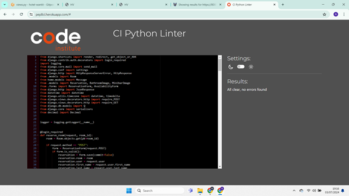
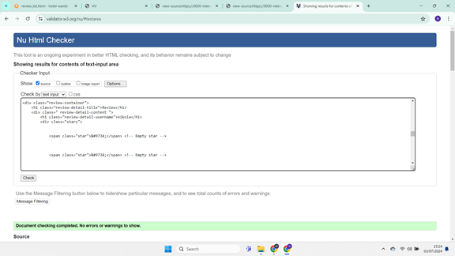

# Validation Results

## Description

All validations for views, URLs, and models across the applications (Bookings, Reviews, Hotel, and Home) were successful. Each section below provides detailed validation results for each component.

## Table of Contents

- [Bookings App](#bookings-app)
  - [Views](#views)
  - [URLs](#urls)
  - [Models](#models)
- [Reviews App](#reviews-app)
  - [Views](#views-1)
  - [URLs](#urls-1)
  - [Models](#models-1)
- [Hotel App](#hotel-app)
  - [Views](#views-2)
  - [URLs](#urls-2)
  - [Models](#models-2)
- [Home App](#home-app)
  - [Views](#views-3)
  - [URLs](#urls-3)
  - [Models](#models-3)
- [HTML Files](#html-files)
- [CSS Validation](#css-validation)
- [JavaScript (JS) Validation](#javascript-js-validation)
- [Lighthouse Reports](#lighthouse-reports)

---

## Validator Used

- **Validator:** PEP8CI Validator
- **Link to Validator:** [PEP8CI Validator](https://pep8ci.herokuapp.com/#)

---

## Bookings App

### Views

All views in the Bookings app passed validation.

[Back to Top](#table-of-contents)

### URLs

All URLs in the Bookings app passed validation.

[Back to Top](#table-of-contents)

### Models

All models in the Bookings app passed validation.

[Back to Top](#table-of-contents)

---

## Reviews App

### Views

All views in the Reviews app passed validation.

[Back to Top](#table-of-contents)

### URLs

All URLs in the Reviews app passed validation.

[Back to Top](#table-of-contents)

### Models

All models in the Reviews app passed validation.

[Back to Top](#table-of-contents)

---

## Hotel App

### Views

All views in the Hotel app passed validation.

[Back to Top](#table-of-contents)

### URLs

All URLs in the Hotel app passed validation.

[Back to Top](#table-of-contents)

### Models

**No models in Hotel App**

---

## Home App

### Views

All views in the Home app passed validation.

[Back to Top](#table-of-contents)

### URLs

All URLs in the Home app passed validation.

[Back to Top](#table-of-contents)

### Models

All models in the Home app passed validation.

[Back to Top](#table-of-contents)

---

## HTML Files

### Comments Approval List (comments_approval_list.html)

Validation of comments_approval_list.html was successful.

[Back to Top](#table-of-contents)

### Review Approval List (review_approval_list.html)

Validation of review_approval_list.html was successful.

[Back to Top](#table-of-contents)

### Reservation Approval List (reservation_approval_list.html)

Validation of reservation_approval_list.html was successful.

[Back to Top](#table-of-contents)

### Admin Interface (admin_interface.html)

Validation of admin_interface.html was successful.

[Back to Top](#table-of-contents)

### Signup Page (signup.html)

Validation of signup.html was successful.

[Back to Top](#table-of-contents)

### Check Availability Page (check_availabilty.html)

Validation of check_availabilty.html was successful.

[Back to Top](#table-of-contents)

### Rooms Page (rooms.html)

Validation of rooms.html was successful.

[Back to Top](#table-of-contents)

### Book Room Page (book_room.html)

Validation of book_room.html was successful.

[Back to Top](#table-of-contents)

### Edit Comment Page (edit_comment.html)

Validation of edit_comment.html was successful.

[Back to Top](#table-of-contents)

### Edit Review Page (edit_review.html)

Validation of edit_review.html was successful.

[Back to Top](#table-of-contents)

### Reviews Page (reviews.html)

Validation of reviews.html was successful.

[Back to Top](#table-of-contents)

### Review Details Page (review_details.html)

Validation of review_details.html was successful.

[Back to Top](#table-of-contents)

### Home Page (home.html)

Validation of home.html was successful.

[Back to Top](#table-of-contents)

---

## CSS Validation

### Validator Used: [W3C CSS Validator](https://jigsaw.w3.org/css-validator/)

#### Validation Result Image

[Back to Top](#table-of-contents)

---

## JavaScript (JS) Validation

### Validator Used: [JSHint](https://jshint.com/)

#### Validation Result Image

[Back to Top](#table-of-contents)

---

## Lighthouse Reports

### Desktop

Lighthouse report for desktop testing:

